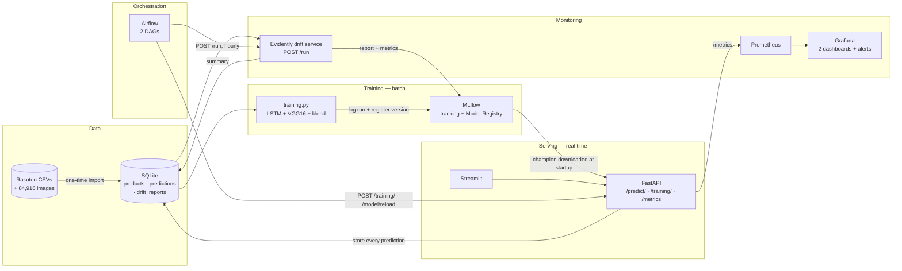
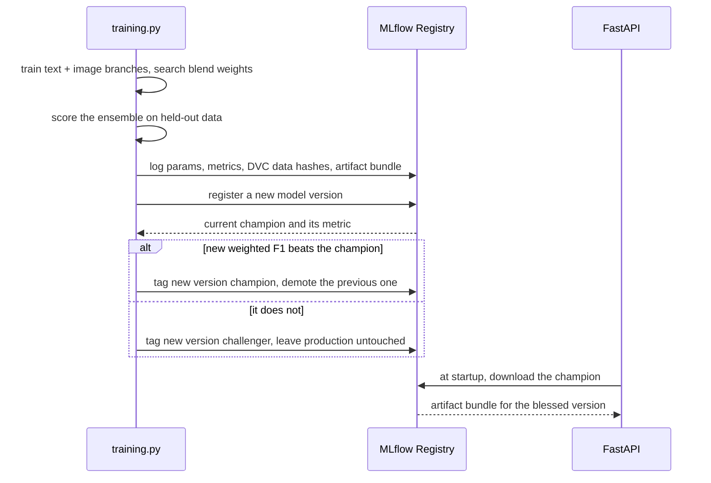

# Rakuten — Multimodal Product Classification, in Production

Classifies an e-commerce product into one of **27 Rakuten `prdtypecode`
categories** from its title, its description and its photograph.

The model is a means, not the point. This repository is about everything
*around* the model: how a training run becomes a versioned artifact, how that
artifact reaches a running service, how the service is observed once it is
serving, and how the whole loop closes when the data moves.

---

## Contents

- [Architecture](#architecture)
- [Quick start](#quick-start)
- [How a model reaches production](#how-a-model-reaches-production)
- [What we found in the baseline](#what-we-found-in-the-baseline)
- [Monitoring](#monitoring)
- [Orchestration](#orchestration)
- [Data versioning](#data-versioning)
- [Project layout](#project-layout)
- [Tests](#tests)
- [Known limitations](#known-limitations)

---

## Architecture



Seven services, each in its own container. The split is not cosmetic: the
MLflow server needs SQLAlchemy and Alembic, which require
`typing_extensions >= 4.6`, while TensorFlow 2.13 pins `< 4.6` and
`protobuf < 5`; Evidently brings Litestar and its own Uvicorn extras. These
dependency sets **cannot coexist in one Python environment**. Isolating them
is what makes the stack installable at all.

| Service | Image | Port | Role |
|---|---|---|---|
| `mlflow` | `ghcr.io/mlflow/mlflow:v2.16.2` | 5000 | Tracking server and Model Registry |
| `api` | `docker/Dockerfile.api` | 8000 | Prediction and training endpoints, Prometheus metrics |
| `streamlit` | `docker/Dockerfile.streamlit` | 8501 | Front end and live presentation |
| `drift` | `docker/Dockerfile.drift` | 8100 | Evidently drift checks, on request |
| `airflow` | `docker/Dockerfile.airflow` | 8080 | Scheduling: training and drift DAGs |
| `prometheus` | `prom/prometheus:v2.54.1` | 9090 | Metric collection |
| `grafana` | `grafana/grafana:11.2.0` | 3000 | Dashboards and alerting |

---

## Quick start

### With Docker (recommended)

```bash
docker compose up -d --build
```

| What | Where |
|---|---|
| API documentation | <http://localhost:8000/docs> |
| Streamlit front end | <http://localhost:8501> |
| MLflow | <http://localhost:5000> |
| Airflow | <http://localhost:8080> (`admin` / `admin`) |
| Drift service | <http://localhost:8100/docs> |
| Prometheus | <http://localhost:9090> |
| Grafana | <http://localhost:3000> (`admin` / `admin`) |

If one of those answers nothing while `docker compose ps` shows the service
healthy, try `127.0.0.1` in place of `localhost`. Where the host resolves
`localhost` to the IPv6 `::1` before the IPv4 `127.0.0.1` — the default on
Windows — the request can fail against a server that is listening, because
the server inside the container is bound to IPv4. Swapping the address in
the URL is the whole fix; nothing in the stack needs changing.

The dataset is mounted from the host rather than baked into the images:
2.4 GB of JPEGs has no business inside a container image.

### Preparing the data (once)

```bash
python src/data/import_raw_data.py                              # CSVs from S3
# images: download from challengedata.ens.fr/challenges/35 into
# data/raw/image_train and data/raw/image_test
python src/data/make_dataset.py data/raw data/preprocessed
python src/data/import_to_db.py                                 # -> data/rakuten.db
```

The last step loads 98,728 products into SQLite as a single source of truth,
replacing three loose CSVs. Only tabular data goes into the database; images
stay on disk and the database stores their paths.

### Training locally

Training runs outside Docker, in a conda environment with the pinned
TensorFlow stack. Every fixed cost is a parameter, so a smoke run takes
minutes rather than hours:

```bash
# fast end-to-end check — around 15 minutes on a CPU laptop
python src/training.py --samples-per-class 15 --val-samples-per-class 10 \
                       --blend-samples-per-class 10 --eval-samples-per-class 10

# full run
python src/training.py
```

A run started this way records to a local file store unless
`MLFLOW_TRACKING_URI` points at the tracking server, and the services read
the server — so a model trained here is not one the API can serve. The
script prints its destination before it starts. To produce a champion the
stack will actually use, either set the variable first:

```bash
export MLFLOW_TRACKING_URI=http://127.0.0.1:5000   # Windows: set MLFLOW_...
```

or train through the API, which is already configured, needs no Python
environment on the host, and reloads the champion itself when the run ends:

```bash
curl -X POST http://127.0.0.1:8000/training/ \
     -H "Content-Type: application/json" \
     -d '{"samples_per_class": 15, "val_samples_per_class": 10,
          "blend_samples_per_class": 10, "eval_samples_per_class": 10}'
curl -s http://127.0.0.1:8000/training/status
```

---

## How a model reaches production



Three properties are worth stating plainly, because each one is a thing that
goes wrong in projects that look like this one:

1. **The decision metric comes from data nothing has fitted on.** Three
   disjoint splits, each with one job: `train` fits the two branches,
   `val` drives early stopping *and* the search for the blend weights — both
   are model selection — and `test` is scored once, at the end, to produce
   `ensemble_test_weighted_f1`. That is the only number promotion depends on.
   Getting here took fixing the split itself: validation used to be drawn out
   of the test set and never removed from it, so the "held-out" metric was
   measured on rows the networks had already seen.
2. **A new model is not automatically better.** It is promoted only if it
   strictly beats the reigning champion; otherwise it is kept as a
   challenger and the serving model does not change.
3. **The API serves the registry, not the filesystem.** At startup it
   downloads the champion version's artifacts. If the registry is
   unreachable it falls back to the local `models/` directory and says so in
   `/health`, so serving degrades instead of stopping.

### Verified promotion

Two runs with identical hyperparameters, differing only in the code fixes
described below:

| | v1 | v2 |
|---|---|---|
| `ensemble_val_weighted_f1` | 0.0809 | **0.1261** |
| `ensemble_val_accuracy` | 0.1222 | 0.1481 |
| `vgg16_val_accuracy` | 0.1556 | 0.2222 |
| Registry decision | champion | **promoted**, v1 demoted |

Those two ran before the split was corrected, so their metric carries the old
`ensemble_val_` name and was measured on contaminated rows. They are kept
here because the *comparison* is still valid — identical hyperparameters,
identical data, only the code differing — but their absolute values are not
comparable with anything scored since.

---

## What we found in the baseline

The starting repository contained four mismatches between how the model was
**trained** and how it was **served**. None of them raised an error. All of
them silently degraded predictions, and the first one made retraining
completely pointless.

| # | Training wrote | Serving read | Effect |
|---|---|---|---|
| 1 | `models/best_weights.pkl` | `models/best_weights.json` | The JSON was never regenerated, so **retraining changed nothing at all** |
| 2 | `models/mapper.pkl` | `models/mapper.json` | Class indices decoded with a stale mapping |
| 3 | Raw 0–255 pixels | `vgg16.preprocess_input` | Image branch trained and scored on different distributions; the blend gave it weight `0.0` |
| 4 | `designation + description` | `description` only | Products without a description reached the model as an **empty string** |

Mismatch 4 was visible in the output before it was visible in the code: four
unrelated products — a puppet, a trading card, a pool pump and a paper
shredder — all came back as the same class with confidence identical to the
sixteenth decimal, because the model was receiving the same empty input for
all of them.

All four are fixed, and each is pinned by a test that fails in CI if the
training and serving paths diverge again.

A fifth problem was methodological rather than a mismatch, and surfaced from
the same symptom: the blend search kept assigning the image branch a weight
of exactly `0.0` even though it scored *better* than the text branch. The
reason was that the weights — a hyperparameter — were being searched on
training data, where the text branch's greater capacity to memorise made it
look superior. Underneath that sat a worse problem: the validation set was
sampled out of the test set and never removed, so the two overlapped and no
split was genuinely held out.

Both are now fixed. The splits are disjoint and tested as such, the weights
are searched on validation, and the promotion metric is scored on test.

---

## Monitoring

### Data drift

A scheduled Evidently job compares recent production traffic against a
sample of the training data, writes an HTML report, logs the metrics to
MLflow and records a summary the API exposes to Prometheus.

```bash
python src/drift_detection.py --current-limit 500
```

Two different things are measured, and the distinction matters:

- **Input drift** (`text_length`, `word_count`) — the same quantity on both
  sides. A shift means the products being sent to the API no longer look
  like the ones it was trained on.
- **Prediction drift** (`prdtypecode`) — true labels on the reference side,
  predicted labels on the current side. A shift means the model's output mix
  has moved away from the historical class balance. That can mean the
  traffic changed *or* that the model degraded; it is a symptom, not a
  diagnosis.

### Dashboards

| Dashboard | Shows |
|---|---|
| **API health** | Request rate and status codes per route, p95 latency, error rate, readiness, training activity |
| **Model & data drift** | Predicted class distribution, mean confidence, served model version, drift verdict, share of drifted columns, report age |

Both are provisioned from `monitoring/grafana/dashboards/`, so they exist the
moment the stack starts.

### Alerts

Two alert rules, both provisioned:

- **Drift above the retraining threshold** — more than half the monitored
  columns drifted.
- **The drift monitor has gone quiet** — no report in 24 hours. This matters
  as much as the first: a monitoring job that stopped running looks exactly
  like a healthy system.

Both inform; neither acts. The first one used to POST to the API's training
endpoint through a Grafana webhook, which was the right design before there
was an orchestrator — and the wrong one after. It meant two independent
automatic triggers for the same retrain, on different schedules, one of them
firing whether or not the DAGs were unpaused. Nothing in a started run said
which trigger had started it. Airflow is the single automated path now; the
alerts are what a person reads. See
`monitoring/grafana/provisioning/alerting/contact-points.yml`, which deletes
the old contact point explicitly, because Grafana's alerting provisioning is
additive and a removed definition would otherwise keep firing from the
`grafana-data` volume.

---

## Orchestration

Two DAGs, at <http://localhost:8080>. Both are paused on first start; unpause
them in the UI, or trigger one by hand to watch it run.

**`rakuten_training`** — Sundays at 03:00, and whenever drift asks for it.

```
start_training  ──▶  wait_for_training  ──▶  report_registry_decision  ──▶  reload_champion
POST /training/      GET /training/status     GET /training/status            POST /model/reload
   202, no wait      sensor, reschedule       reads the registry verdict      API serves the new champion
```

**`rakuten_drift_check`** — hourly.

```
run_drift_check  ──▶  drift_above_threshold  ──▶  trigger_training
POST /run on the      short circuit: stops        TriggerDagRunOperator,
drift service         unless action_required      does not wait for it
```

The design rule is one sentence: **Airflow orchestrates over HTTP and
computes nothing itself.** Every task is a request to the service that owns
the work, so the Airflow image installs neither TensorFlow nor Evidently nor
the MLflow server. That is not tidiness — it is the same dependency conflict
that split this project into services in the first place, and an orchestrator
that imported the training code would re-create it. `tests/test_dags.py`
enforces it: a heavy import in a DAG module, or a heavy package in
`Dockerfile.airflow`, fails the build.

Two consequences worth naming:

- **The sensor reschedules rather than pokes.** A full run takes hours, and
  in poke mode it would hold the SequentialExecutor's only slot for all of
  them — nothing else, including the drift check, would ever run.
- **The drift check does not wait for training.** It fires the DAG and
  returns, so the hourly schedule never backs up behind a multi-hour run.

Scheduled runs use a small configuration (`samples_per_class=100`, 3 LSTM
epochs) so they finish in minutes. For a full run, use **Trigger DAG w/
config** in the UI:

```json
{"training_params": {"samples_per_class": 600, "epochs_lstm": 5}}
```

---

## Data versioning

DVC tracks the datasets, initialised without Git as the brief specifies, so
the `.dvc` pointer files are themselves the record of a data version:

```bash
bash scripts/setup_dvc.sh            # CSVs
bash scripts/setup_dvc.sh --images   # CSVs + the 84,916 training images
```

Every training run then tags its MLflow run with those hashes
(`data.X_train_update.csv`, `data.image_train`, …). Without this, two runs
with identical parameters and different metrics are unexplainable. With it, a
disagreement between runs is always attributable to either the code or the
data.

---

## Project layout

```
.
├── airflow/
│   └── dags/                     rakuten_training · rakuten_drift_check
├── app/
│   └── streamlit_app.py          front end and live presentation
├── docker/                       one Dockerfile per service
├── monitoring/
│   ├── prometheus.yml
│   └── grafana/                  provisioned dashboards, datasource, alerts
├── requirements/                 one dependency set per service
├── scripts/
│   └── setup_dvc.sh
├── src/
│   ├── api.py                    FastAPI service
│   ├── training.py               training entry point
│   ├── predict.py                batch inference + shared artifact loader
│   ├── drift_detection.py        Evidently job
│   ├── drift_service.py          HTTP wrapper the drift DAG calls
│   ├── mlflow_utils.py           registry, champion/challenger promotion
│   ├── db.py                     SQLite access layer
│   ├── data_version.py           DVC hashes for MLflow
│   ├── data/                     one-time import scripts
│   ├── features/build_features.py
│   └── models/train_model.py
├── tests/                        56 tests
└── docker-compose.yml
```

---

## Tests

```bash
python -m pytest tests/ -q
```

Forty-nine tests, running in seconds without TensorFlow, without Airflow,
without the dataset and without a trained model — which is what makes them usable as a CI
gate. They cover:

- **Promotion rules** against a real throwaway MLflow registry: the first
  model becomes champion, a worse one does not displace it, a better one
  does.
- **The training/serving artifact contract**: anything inference opens must
  travel inside the registered model bundle, and the API must load through
  the shared loader rather than opening model files itself.
- **The four mismatches above**, each pinned so a regression fails the build.
- **The monitoring layer**: prediction and drift round trips, and the rule
  that a failed monitoring write must never break a served prediction.
- **The orchestration boundary**: no DAG may import TensorFlow, Evidently or
  the training code, the Airflow image may install none of them, and every
  endpoint a DAG calls must exist in the service that serves it. One test
  builds a real `DagBag` and skips where Airflow is absent — which is
  everywhere but its own image.
- **The drift service's HTTP contract**: `POST /run` must accept an empty
  body and fall back to its defaults. Every field has one, so requiring the
  body contradicted the model — and only a person typing the obvious command
  ever hit it, since the DAG always sends all three.
- **The observe/act boundary**: no Grafana contact point may call the API's
  training endpoint, the superseded webhook stays explicitly deleted, and the
  drift alert keeps firing at the same threshold the DAG acts on. These guard
  a silent regression: re-adding that webhook breaks nothing and restores a
  second, invisible retrain trigger.

---

## Known limitations

Stated plainly, because an honest limitation is worth more than a hidden one:

- **Ground-truth drift cannot be measured.** Live predictions have no
  labels, so accuracy in production is unobservable. Closing that would need
  a feedback loop, which is out of scope here.
- **The image branch's head is oversized for the data.** `Flatten()` over
  VGG16's output is 25,088 features into a `Dense(256)` trained from scratch:
  6.4M parameters learned from a few hundred images. It is why that branch's
  loss sits in the tens, and it is a modelling problem rather than a pipeline
  one, so it is named rather than chased.
- **The model is small on purpose.** One epoch on a subsample, trained on a
  CPU laptop. The pipeline is built to retrain and promote something better
  without a single change to the serving path.
- **SQLite, not Postgres.** Right for a single-node deployment and for a
  database that is read far more than it is written. A multi-writer
  deployment would want a server.
- **Airflow runs on SequentialExecutor and SQLite.** One task at a time, no
  worker fleet. It is the right size for a single-node demo and the wrong
  size for anything parallel; moving to LocalExecutor and Postgres is
  configuration, not redesign.
- **The DAGs are paused on first start.** `DAGS_ARE_PAUSED_AT_CREATION` is
  on, so nothing fires until someone unpauses it in the UI. Deliberate: an
  hourly drift check that starts retraining unattended on first `up` is not
  a pleasant surprise.
